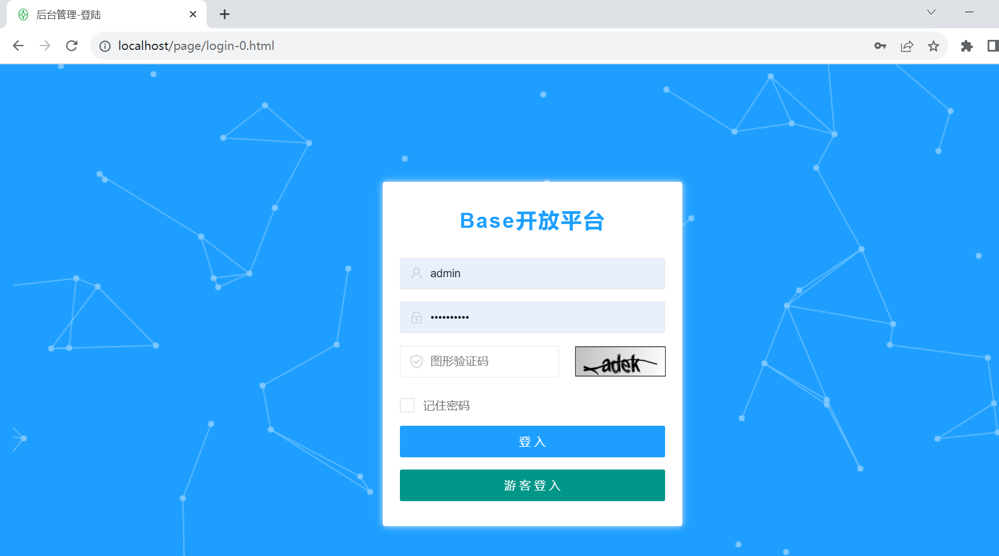
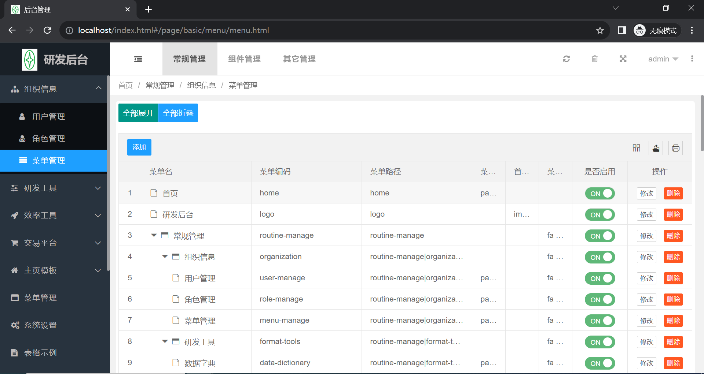

# SpringBoot单体服务
前端：LayUI
后端：SpringBoot
默认80端口启动
默认登录密码：admin/Admin@123!

# 打包/依赖
## mvn clean package
## 可依赖jar
target/base-web.jar
## 可运行jar
target/base-web-run.jar

# 依赖使用须知：
1、添加组件坐标
<repositories>
<repository>
<id>base-repo</id>
<name>私有仓</name>
<url>http://39.101.202.67:18081/repository/maven-public/</url>
</repository>
</repositories>
2、添加依赖
<dependency>
<groupId>com.base</groupId>
<artifactId>base-web</artifactId>
<version>1.0.0-20230612.021929-11</version>
</dependency>
3、在POM中引用当前项目，需要在的Main添加@EnableBaseWeb

# 启动项目
nohup java -jar xxx.jar --spring.profiles.active=prod  
--spring.profiles.active=prod  指定读取指定前缀的配置文件

# Jwt认证+拦截
src/main/java/com/base/basic/config/JwtInterceptorConfig.java
src/main/java/com/base/basic/util/jwt

# 目录结构
v0：服务架构的基座逻辑代码
vn：业务逻辑代码

# 数据库初始化脚本路径
resources/static/db/

# 运行演示

